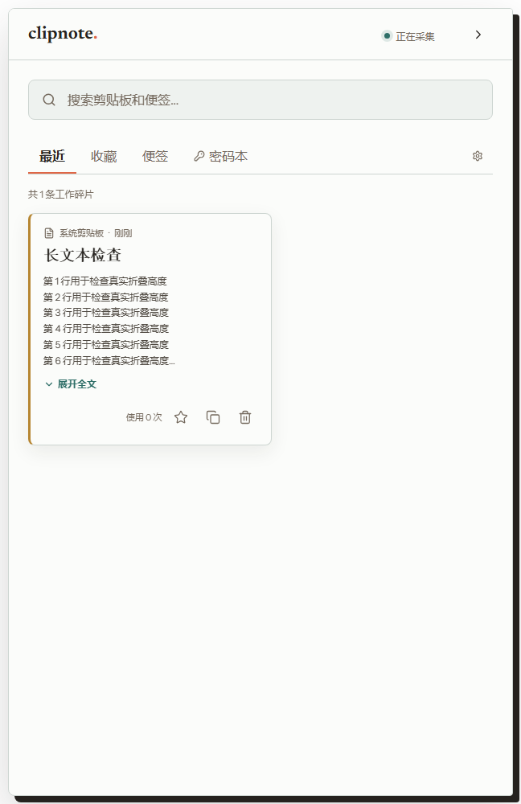
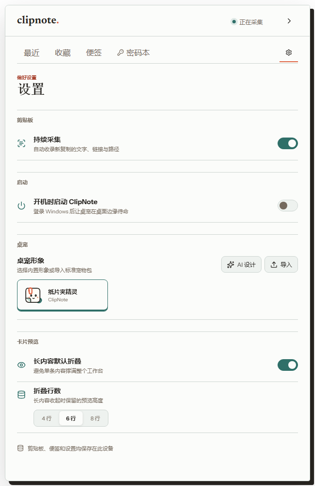

<div align="center">

# ClipNote

**贴在桌面边缘的轻量剪贴板与便签工具**

本地采集、随手搜索、快速收起。内容只保存在你的 Windows 设备中。


</div>

<p align="center">
  
  
</p>

<p align="center">
  
  <br />
  <sub>收起后化身 56 x 56 的原创纸片夹桌宠</sub>
</p>

## 为什么做 ClipNote

复制过的命令、链接和临时文字经常只在几分钟内有用，却很容易被下一次复制覆盖。ClipNote 把这些工作碎片留在桌面边缘：需要时展开，不需要时缩成一个 `56 × 56` 图标，不占任务栏，也不打断当前工作。

## 功能

- **自动采集文本剪贴板**：识别普通文本、链接、代码和文件路径，不占用系统 `Ctrl + V`。
- **本地资料库**：按时间浏览，支持搜索、收藏、再次复制和删除。
- **长内容折叠**：长文本默认收起，可展开全文；预览高度支持 4、6、8 行。
- **桌面便签**：创建、编辑和删除便签，正文过长时自动折叠。
- **截图便签**：可粘贴、拖放或选择 PNG、JPEG、WebP、GIF 图片。
- **原创桌宠形态**：收起后化身 56 x 56 的纸片夹桌宠，带有克制的呼吸、眨眼和状态动效。
- **自定义桌宠**：可导入标准宠物包，在设置页直接选择、预览或删除。
- **AI 形象工坊**：用文字与可选参考图生成桌宠原画，并自动组装为经过校验的动画图集。
- **本地加密密码本**：独立主密码、条目搜索、强密码生成、安全复制和闲置自动锁定。
- **位置记忆**：桌宠可自由拖动，重启后恢复到上次位置；显示器变化时自动回到可见区域。
- **开机启动**：可在设置页选择登录 Windows 后自动启动，随时可以关闭。
- **轻量常驻**：不占任务栏，支持右键隐藏到系统托盘。
- **全局快捷键**：在其他应用中使用 `Ctrl + Alt + Space` 展开或收起。
- **采集控制与设置**：随时暂停采集，显示偏好会自动保存在本机。

## 安装

### Windows 安装包

前往 [Releases](../../releases/latest) 下载最新版本：

- `ClipNote_*_x64-setup.exe`：推荐，大多数用户直接使用。
- `ClipNote_*_x64_en-US.msi`：适合 MSI 部署或企业环境。

当前构建面向 Windows 10/11 x64。若系统缺少 Microsoft Edge WebView2 Runtime，安装程序或系统会提示补充。

### 从源码运行

先准备以下环境：

- Node.js 22 LTS 与 pnpm
- Rust stable 工具链
- Windows C++ 构建工具与 WebView2 开发环境

克隆仓库后，在项目目录中运行：

```powershell
pnpm install
pnpm tauri dev
```

## 使用

| 操作 | 方式 |
| --- | --- |
| 展开 / 收起工作台 | `Ctrl + Alt + Space` |
| 展开边缘图标 | 单击图标 |
| 移动边缘图标 | 按住并拖动 |
| 隐藏到托盘 | 右键边缘图标 |
| 从托盘恢复 | 单击托盘图标，或选择“打开 ClipNote” |
| 暂停 / 恢复采集 | 顶部状态按钮、设置页或托盘菜单 |
| 锁定密码本 | 密码本右上角锁定按钮 |
| 设计 AI 桌宠 | 设置 → 桌宠 → AI 设计 |
| 快速收起 | 点击右上角箭头，或按 `Esc` |

长剪贴板内容默认显示 6 行。点击“展开全文”查看完整内容，也可在设置中调整为 4 行或 8 行。

## 本地数据与隐私

ClipNote 不需要账号。剪贴板记录、便签、截图和采集状态保存在应用数据目录中的 `clipnote.sqlite3`；密码本使用独立的 `vault.sqlite3`；界面显示偏好保存在本地 WebView 存储中。

- 当前版本只自动采集文本剪贴板，不会把剪贴板内容上传到网络。
- 截图仅在用户主动添加到便签时保存。
- 单张便签图片前端限制为 4 MB，支持 PNG、JPEG、WebP 和 GIF。
- 密码本使用 Argon2id 派生密钥与 XChaCha20-Poly1305 加密，主密钥只在解锁期间保留于 Rust 内存。
- 密码本主密码不会保存，也没有找回通道；请自行妥善保管。
- 从密码本复制的内容不会进入 ClipNote 采集记录，并会在剪贴板未被再次改动时于 30 秒后清除。
- OpenAI API Key 保存在 Windows 凭据管理器。只有主动生成桌宠时，形象描述和可选参考图才会发送到 OpenAI。
- 退出应用可通过系统托盘菜单完成。

## 技术栈

| 层 | 技术 |
| --- | --- |
| 桌面运行时 | Tauri 2 |
| 原生能力 | Rust、arboard、rusqlite、Windows Credential Manager |
| 界面 | React 19、TypeScript、Vite |
| 状态与动效 | Zustand、Motion |
| 数据库 | SQLite（本地文件） |
| 测试 | Vitest、Testing Library、Playwright |

## 项目结构

```text
src/
  app/                 应用编排与数据流
  bridge/              Tauri 命令和浏览器预览桥接
  features/library/    剪贴板资料库
  features/notes/      便签与截图附件
  features/pets/       桌宠播放器、画廊与 AI 形象工坊
  features/settings/   本地显示偏好
  features/shell/      边缘图标、工作台与导航
  features/vault/      密码本解锁、条目与设置界面
src-tauri/src/
  ai_pets.rs           AI 图像 Provider 与凭据管理
  data.rs              剪贴板采集与 SQLite 持久化
  pets.rs              宠物包校验、导入与图集组装
  vault/               密钥派生、加密存储与安全剪贴板
  window.rs            窗口展开、收起、拖动与隐藏
  shortcuts.rs         全局快捷键
  tray.rs              系统托盘
tests/e2e/             Chromium 交互与视觉回归
```

## 开发与验证

```powershell
# 前端单元测试
pnpm test

# 代码检查与生产构建
pnpm lint
pnpm build

# 浏览器交互和视觉回归
pnpm test:e2e

# Rust 测试与静态检查
cargo test --manifest-path src-tauri/Cargo.toml
cargo clippy --manifest-path src-tauri/Cargo.toml --all-targets -- -D warnings
```

## 打包

```powershell
pnpm tauri build
```

Windows 安装包会生成到：

```text
src-tauri/target/release/bundle/msi/
src-tauri/target/release/bundle/nsis/
```

## 当前版本

ClipNote `0.3.0` 新增标准化自定义桌宠、AI 形象工坊和本地加密密码本。密码本支持安全复制、自动锁定与窗口内容保护；AI 桌宠支持提示词、参考图和 Windows 凭据管理器。原有剪贴板采集、便签、截图附件、长文本折叠、位置记忆、托盘和快捷键流程保持可用。
